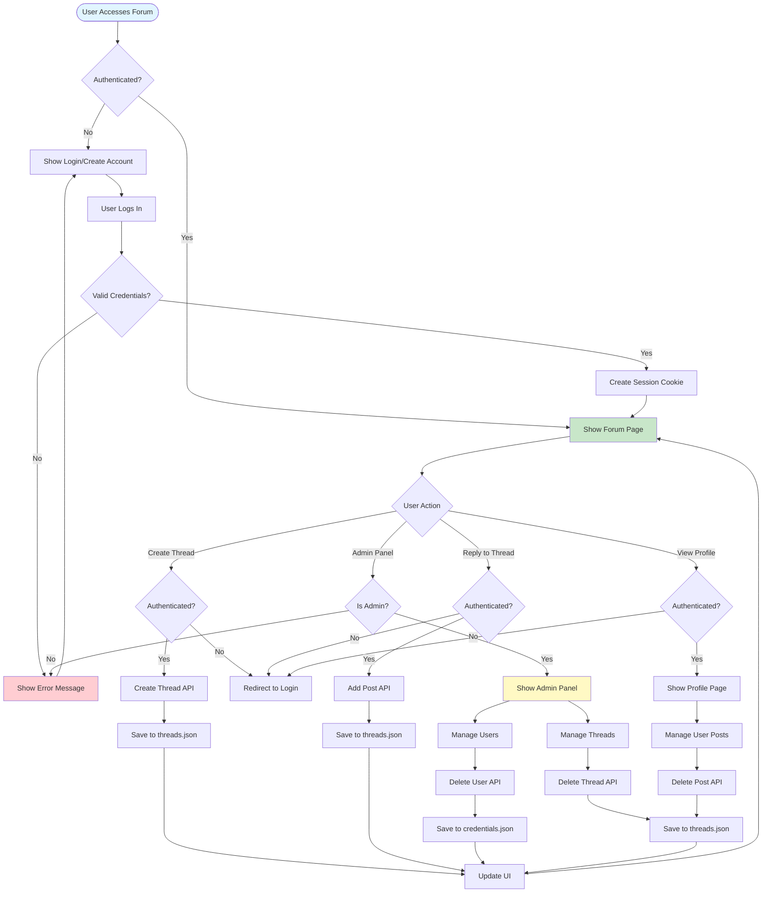

# Forum Application

A full-stack forum application built with Golang backend and TypeScript frontend.

## Overview

This forum application provides a complete discussion platform with user authentication, thread management, and administrative features. The backend is implemented in Go using the standard `net/http` package, and the frontend is written in TypeScript and compiled to ES5 with inline source maps.

## Architecture

### Backend (Golang)

The backend is organized into multiple modules:

- **main.go**: Entry point that initializes the server and sets up routes
- **models.go**: Data structures for users, posts, and threads
- **auth.go**: Authentication and session management using `gorilla/sessions`
- **data.go**: Data persistence layer for credentials and threads (JSON files)
- **handlers.go**: HTTP request handlers for all API endpoints

### Frontend (TypeScript)

The frontend is a single-page application (SPA) with the following modules:

- **main.ts**: Application entry point and routing
- **api.ts**: API client for backend communication
- **utils.ts**: Utility functions (date formatting, alerts, modals)
- **index.ts**: Main forum page implementation
- **login.ts**: Login page
- **createAccount.ts**: Account creation page
- **createThread.ts**: Thread creation page
- **profile.ts**: User profile and post management
- **admin.ts**: Administrator management interface

## Features

### User Features

- **Account Management**: Create account, log in, log out
- **Thread Creation**: Authenticated users can create new discussion threads
- **Posting**: All users can reply to threads
- **Profile Management**: Users can view their posts and change their password
- **Post Deletion**: Users can delete their own posts

### Administrator Features

- **User Management**: View all users, delete users, modify admin status
- **Password Reset**: Reset any user's password
- **Thread Management**: Delete entire threads
- **Post Management**: Delete any post (not just their own)

## Data Storage

All data is stored in JSON files in the `data/` directory:

- **credentials.json**: User credentials with securely hashed passwords
- **threads.json**: All forum threads and posts with Unix timestamps

The admin account is automatically initialized on first run:
- Username: `admin`
- Password: `admin123`

**Important**: Change the admin password immediately after first deployment!

## Security

- Passwords are hashed using bcrypt
- Sessions use secure cookies with `HttpOnly: true` and `SameSite: Strict`
- All user inputs are sanitized to prevent XSS attacks
- Authentication is required for creating threads and posting
- Admin-only endpoints are protected by middleware

## Project Structure

```
go_forum/
├── backend/           # Golang backend code
│   ├── main.go       # Server entry point
│   ├── models.go     # Data models
│   ├── auth.go       # Authentication
│   ├── data.go       # Data persistence
│   ├── handlers.go   # HTTP handlers
│   └── *_test.go     # Unit tests
├── frontend/          # TypeScript frontend code
│   ├── src/          # Source files
│   ├── dist/         # Compiled output
│   └── tsconfig.json # TypeScript configuration
├── data/             # Data files (gitignored)
│   ├── credentials.json
│   └── threads.json
├── go.mod            # Go module definition
├── .gitignore        # Git ignore rules
└── README.md         # This file
```

## Building

### Backend

```bash
cd backend
go build -o go_forum .
```

### Frontend

```bash
cd frontend
tsc
cp src/index.html dist/index.html
```

Or use the build script:

```bash
cd frontend
./build.sh
```

The compiled JavaScript files and `index.html` will be in `frontend/dist/`.

## Running Tests

### Backend Tests

```bash
cd backend
go test -v ./...
```

All tests should pass.

## Application Flow

The following flowchart illustrates the application architecture and request flow:



## API Endpoints

### Authentication
- `POST /api/login` - Log in user
- `POST /api/logout` - Log out user
- `POST /api/create-account` - Create new account
- `GET /api/session` - Get current session info

### Threads
- `GET /api/threads` - Get all threads
- `GET /api/thread?id={id}` - Get specific thread
- `POST /api/create-thread` - Create new thread (requires auth)
- `DELETE /api/delete-thread` - Delete thread (requires admin)

### Posts
- `POST /api/add-post` - Add reply to thread (requires auth)
- `DELETE /api/delete-post` - Delete post (requires auth, owner or admin)

### Users (Admin Only)
- `GET /api/users` - Get all users
- `DELETE /api/delete-user` - Delete user
- `POST /api/reset-password` - Reset user password
- `POST /api/update-user-admin` - Update user admin status

## Session Configuration

Sessions are configured with:
- `HttpOnly: true` - Prevents JavaScript access to cookies
- `SameSite: http.SameSiteStrictMode` - CSRF protection
- `MaxAge: 7 days` - Session expiration

## TypeScript Configuration

The frontend TypeScript is configured to:
- Target ES5 for browser compatibility
- Use AMD module system
- Include ES2017 and DOM libraries
- Generate inline source maps
- Output to `frontend/dist/`

## Browser Compatibility

The application uses:
- Bootstrap 5.3.0 for UI styling
- ES5 JavaScript (compiled from TypeScript)
- Modern browser APIs (Promise, fetch via XMLHttpRequest)

## Development

### Prerequisites

- Go 1.24+ (or compatible version)
- TypeScript compiler (`tsc`)
- Modern web browser

### Running Locally

1. Build the frontend:
   ```bash
   cd frontend
   tsc
   cp src/index.html dist/index.html
   ```
   Or use the build script:
   ```bash
   cd frontend
   ./build.sh
   ```

2. Run the backend:
   ```bash
   cd backend
   go run .
   ```

3. Access the forum at `http://localhost:8080`

## Deployment

### Production Deployment Steps

1. **Build the Frontend**:
   ```bash
   cd frontend
   tsc
   ```
   This compiles all TypeScript files to JavaScript in the `frontend/dist/` directory.

2. **Build the Backend**:
   ```bash
   cd backend
   go build -o go_forum .
   ```
   This creates an executable binary named `go_forum`.

3. **Set Up Data Directory**:
   ```bash
   mkdir -p data
   ```
   The application will automatically create `credentials.json` with the admin account on first run.

4. **Configure Environment** (Optional):
   - Set the server port by modifying `serverPort` in `backend/main.go` (default: 8080)
   - Change the session secret key in `backend/main.go` for production

5. **Run the Application**:
   ```bash
   ./go_forum
   ```
   Or from the backend directory:
   ```bash
   cd backend
   ./go_forum
   ```

6. **Access the Forum**:
   - Open your browser and navigate to `http://localhost:8080` (or your configured port)
   - Log in with the default admin credentials:
     - Username: `admin`
     - Password: `admin123`
   - **Important**: Change the admin password immediately after first login!

### Deployment Commands Summary

```bash
# 1. Build frontend
cd frontend && tsc && cp src/index.html dist/index.html && cd ..
# Or use the build script:
# cd frontend && ./build.sh && cd ..

# 2. Build backend
cd backend && go build -o go_forum . && cd ..

# 3. Create data directory
mkdir -p data

# 4. Run the application
cd backend && ./go_forum
```

### Production Considerations

- **Security**: Change the session secret key in production
- **Port**: Configure firewall rules for your chosen port
- **HTTPS**: Use a reverse proxy (nginx, Apache) with SSL/TLS certificates
- **Process Management**: Use systemd, supervisor, or similar for process management
- **Logging**: Configure proper logging for production monitoring
- **Backup**: Regularly backup the `data/` directory
- **Admin Password**: Change the default admin password immediately

### Example systemd Service

Create `/etc/systemd/system/go-forum.service`:

```ini
[Unit]
Description=Go Forum Application
After=network.target

[Service]
Type=simple
User=www-data
WorkingDirectory=/path/to/go_forum/backend
ExecStart=/path/to/go_forum/backend/go_forum
Restart=always

[Install]
WantedBy=multi-user.target
```

Then enable and start:
```bash
sudo systemctl enable go-forum
sudo systemctl start go-forum
```

## Code Documentation

All code is extensively documented with Doxygen-style comments:
- File headers with creation date and author
- Function documentation with parameters and return values
- Struct and variable documentation
- Inline comments explaining complex logic

## License

This project is provided as-is for educational and development purposes.

## Author

Victor Yeh
Created: 2025-12-19

